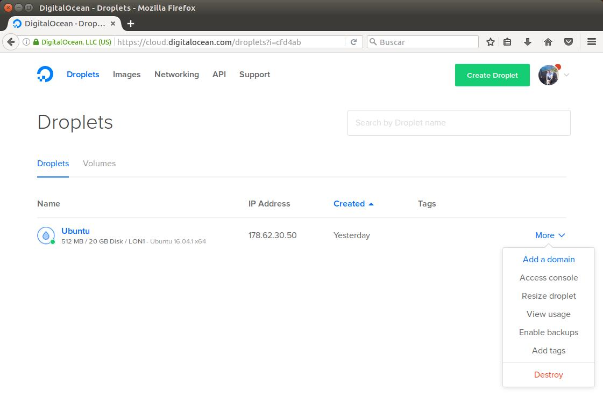

# Práctica proyecto final: Nueva funcionalidad para el paquete npm
## Paquete: gitbook-start-digitalocean-merquililycony


# Objetivo:
*El objetivo de esta práctica es extender el package NodeJS publicado en npm en una práctica anterior con una nueva*
*funcionalidad que permita que los usuarios realizar un despliegue automático en el servidor de Digital Ocean utilizando un dominio con certificado **SSL Let's Encrypt**

# Paso 1: Creando una cuenta en Digital Ocean

Accedemos a [https://www.digitalocean.com/](https://www.digitalocean.com/) y nos creamos una cuenta. Una vez dentro hacemos click en **DROPLETS** para crear la configuración de la máquina.
Elegimos una distribución de linux, en este caso se ha utilizado UBUNTU, a continuación elegimos la ubicación de nuestro servidor (entre más cerca de donde se encuentre nuestro público objetivo mejor) y hacemos clic en crear nuestra máquina.


# Paso 2: Acceso SSH a Digital Ocean

Al crear la configuración de nuestra máquina recibiremos un email con los datos de acceso.
Abrimos una consola y ejecutamos **shh root@IP** , en nuestro caso sería:


```bash
ssh root@178.62.123.244
```

Introducimos la contraseña que nos ha llegado al email, la confirmamos y luego nos pedirá nuestra nueva contraseña.
El siguiente paso es configurar una clave ssh para poder acceder automáticamente a nuestro servidor sin loguearnos. Así que volvemos a nuestra máquina local con el siguiente comando:

```bash
exit
```

Vamos al directorio **~/.ssh** de nuestra máquina local y en caso de no tener ninguna clave ejecutamos el siguiente comando:

```bash
ssh-keygen -t rsa
```

Por último copiamos la información de nuestra clave pública de la máquina local a nuestro servidor remoto, en este ejemplo copiaremos la información de **id_dsa.pub** que se encuentra en la máquina local al fichero **~/.ssh/authorized_keys** de la máquina remota. Con el comando que aparece a continuación. Te en cuenta que **root@178.62.123.244** es el usuario y la IP de la máquina remota.

```bash
cat ~/.ssh/*.pub | ssh root@178.62.123.244 'umask 077; mkdir -p .ssh; cat >> .ssh/authorized_keys'
```

# Paso 3: Preparando la máquina remota para correr un servidor Express

Instalamos **NODEJS**, **NPM** y **GULP** en nuestro servidor remoto

```bash
ssh root@178.62.123.244
curl -sL https://deb.nodesource.com/setup_6.x | sudo -E bash -
sudo apt-get install -y nodejs
sudo apt-get install -y build-essential
sudo npm install --global gulp-cli
```

# Paso 4: Crear y desplegar el libro.

Nos colocamos en nuestra máquina local con **exit** y ejecutamos los siguientes comandos:

```bash
exit
sudo npm install -g nuevo-libro-merquililycony
gitbook-start -d <directorio>
cd <directorio>
npm install
npm install --save gitbook-start-digitalocean-merquililycony
gulp paquete-ocean
```

Al ejecutar **gulp paquete-ocean** se solicitará por pantalla los datos de nuestro github.
A continuación entramos en el libro que hemos creado y editamos los campos que se muestran en la imagen con los de nuestro servidor.


Para completar el despliegue, ejecutamos los siguientes comandos:

```bash
gulp deploy
gulp push
gulp deploy-digitalocean
```

Con esto ya podemos acceder a nuestro libro escribiendo la dirección IP de nuestra máquina en Digital Ocean. El servidor está corriendo en el puerto **8080 con http**.

[http://178.62.123.244:8080](http://178.62.123.244:8080)

**NOTA:** Una vez publicado el libro, si desea realizar alguna modificación sobre el mismo, debe acceder al directorio **txt**, actualizar sus archivos de **markdown** y ejecutar los siguientes comandos:

```bash
gulp deploy
gulp push
gulp deploy-update
```


**NOTA:** El **paso 5** y el **paso 6** es opcional. A la finalización de los mismos tendremos un nombre de dominio apuntando a nuestra máquina remota y un **certificado SSL de Let's Encrypt gratis** como se muestra en el siguiente enlance:

[https://equivocateyaprende.es](https://equivocateyaprende.es)

# Paso 5: Vinculando un nombre de dominio a nuestra máquina de Digital Ocean

Se vinculará un nombre de dominio a la IP de la máquina que acabamos de crear en Digital Ocean, de esta forma podemos acceder al libro tecleando el nombre del dominio, pero si deseas puedes acceder con tu dirección IP pública.

Para esto, dentro de nuestra cuenta de Digital Ocean vamos a **Droplets, More, add a domain** y escribimos el nombre del dominio que deseamos vincular.



 Una vez añadido copiamos los NS, vamos al sitio web donde tenemos registrado nuestro dominio y lo pegamos en la **zona de DNS**, en mi caso he utilizado **dondominio.com**. Debes tener en cuenta que este proceso puede tardar hasta 24 horas ya que las DNS deben propagarse por los diversos servidores en todo el mundo.


Existen diversos portales en Internet como [https://www.whatsmydns.net/](https://www.whatsmydns.net/)  donde puedes verificar el estado de las DNS.


# Paso 6: Generar un certificado SSL con Let's Encrypt.

1- Dentro de la máquina local ejecutamos el comando **gulp clone-letsencrypt** para clonar el directorio de Let's Encrypt en el servidor remoto.

```bash
gulp clone-letsencrypt
```

2- El siguiente paso será conectarnos al servidor remoto mediante **SSH** para generar los ciertificados, desde la terminal escribimos **ssh user@ip**

```bash
ssh root@178.62.123.244
```

Nos colocamos dentro del directorio **letsencryp** que clonamos en el paso anterior. Este se encuentra en la ruta donde hemos elegido realizar el despliegue, en mi caso sería **/home** y ejecutamos **sudo -H ./letsencrypt...** donde **example.com** será el nombre del dominio al que le vamos a generar el certificado SSL. Nos saldrá una ventana azul para que aceptemos las condiciones y si todo ha salido correcto, ya hemos generado nuestro **certificado SSL**.


```bash
cd /home/letsencrypt
sudo -H ./letsencrypt-auto certonly --standalone --email info@example.com -d example.com
```


3- Por último volvemos a la máquina local con **exit** y escribimos **gulp start-ssl**,esto creará unos enlaces simbólicos de los certificados y reiniciará el servidor.


```bash
exit
gulp start-ssl
```

Para acceder al libro podemos escribir tanto la dirección IP de nuestra máquina en Digital Ocean cómo el nombre de dominio. El servidor está corriendo en el puerto **8080 con http** y en el **puerto 443 con https**.

[http://178.62.123.244:8080](http://178.62.123.244:8080)

[https://equivocateyaprende.es](https://equivocateyaprende.es)

## Enlaces :

 **Enlace al campus virtual**

 * [Enunciado](https://casianorodriguezleon.gitbooks.io/ull-esit-1617/content/proyectos/sytw/)

 **Repositorio GitHuB y NPM donde se realizó el proyecto**
 
 * [Repo paquete principal](https://github.com/Alu0100673647/nuevo-libro)
 * [Repo plugin despliegue Digital Ocean](https://github.com/ULL-ESIT-SYTW-1617/proyecto-sytw-16-17-merquililycony)
 * [Repo npm plugin Digital Ocean](https://www.npmjs.com/package/gitbook-start-digitalocean-merquililycony)

 **Página de los autores**

 * [Constanza](http://alu0100673647.github.io)
 * [Merquis](http://merquis.github.io)
 * [Liliana](https://alu0100762846.github.io)
