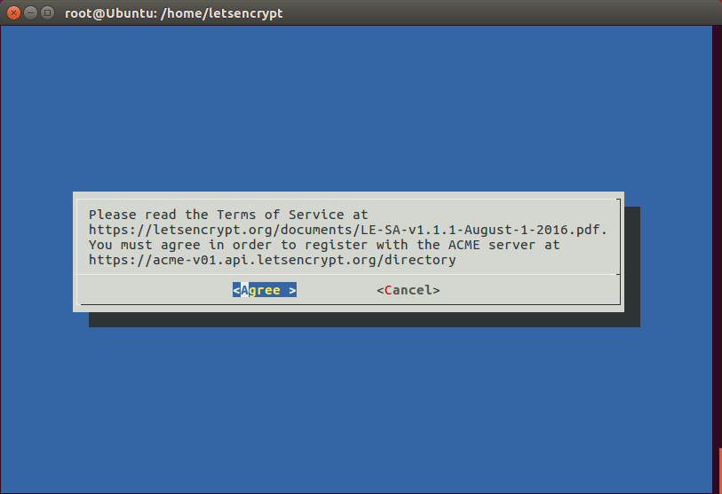

# Paso 6: Generar un certificado SSL con Let's Encrypt.

1- Dentro de la máquina local ejecutamos el comando **gulp clone-letsencrypt** para clonar el directorio de Let's Encrypt en el servidor remoto.

```bash
gulp clone-letsencrypt
```

2- El siguiente paso será conectarnos al servidor remoto mediante **SSH** para generar los ciertificados, desde la terminal escribimos **ssh user@ip**

```bash
ssh root@178.62.123.244
```

Nos colocamos dentro del directorio **letsencryp** que clonamos en el paso anterior. Este se encuentra en la ruta donde hemos elegido realizar el despliegue, en mi caso sería **/home** y ejecutamos **sudo -H ./letsencrypt...** donde **example.com** será el nombre del dominio al que le vamos a generar el certificado SSL. Nos saldrá una ventana azul para que aceptemos las condiciones y si todo ha salido correcto, ya hemos generado nuestro **certificado SSL**.


```bash
cd /home/letsencrypt
sudo -H ./letsencrypt-auto certonly --standalone --email info@example.com -d example.com
```




3- Por último volvemos a la máquina local con el comando **exit** y escribimos **gulp start-ssl**,esto creará unos enlaces simbólicos de los certificados y reiniciará el servidor.


```bash
exit
gulp start-ssl
```

Para acceder al libro podemos escribir tanto la dirección IP de nuestra máquina en Digital Ocean cómo el nombre de dominio. El servidor está corriendo en el puerto **8080 con http** y en el **puerto 443 con https**.

[http://178.62.123.244:8080](http://178.62.123.244:8080)

[https://equivocateyaprende.es](https://equivocateyaprende.es)

