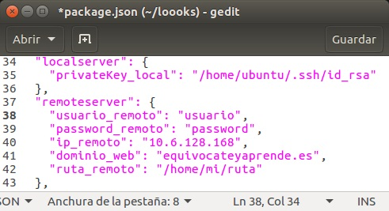
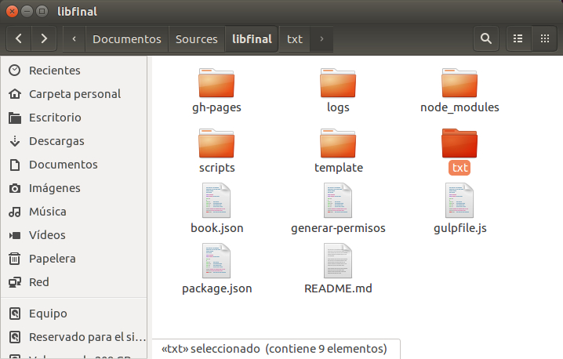

# Paso 4: Crear y desplegar el libro.

Nos colocamos en nuestra máquina local con **exit** y ejecutamos los siguientes comandos:

```bash
exit
sudo npm install -g nuevo-libro-merquililycony
gitbook-start -d <directorio>
cd <directorio>
npm install
npm install --save gitbook-start-digitalocean-merquililycony
```

Entramos en el libro que hemos creado, abrimos el fichero **package.json** y editamos los campos de la imagen de ejemplo que se muestra a continuación con los de nuestro servidor.


+ **privateKey_local:** Clave privada de nuestra máquina local, la encontramos dentro del directorio **~/.ssh**.
+ **usuario_remoto:** Nombre del usuario de la máquina remota.
+ **password_remoto:** Contraseña del usuario de la máquina remota.
+ **ip_remoto: IP:** de la máquina remota.
+ **dominio_web:** **OPCIONAL** Nombre de dominio para tu libro.
+ **ruta_remoto:** Ruta donde se desplegará tu libro en el servidor remoto.



Para completar el despliegue, ejecutamos los siguientes comandos:

```bash
gulp paquete-ocean
gulp deploy
gulp push
gulp deploy-digitalocean
```

Con esto ya podemos acceder a nuestro libro escribiendo la dirección IP de nuestra máquina en Digital Ocean. El servidor está corriendo en el puerto **8080 con http**.

[http://178.62.123.244:8080](http://178.62.123.244:8080)

**NOTA:** Una vez publicado el libro, si desea realizar alguna modificación sobre el mismo, debe acceder al directorio **txt**, actualizar sus archivos de **markdown** y ejecutar los siguientes comandos:

```bash
gulp deploy
gulp push
gulp deploy-update
```




**NOTA:** El **paso 5** y el **paso 6** es opcional. A la finalización de los mismos tendremos un nombre de dominio apuntando a nuestra máquina remota y un **certificado SSL de Let's Encrypt gratis** como se muestra en el siguiente enlance:

[https://equivocateyaprende.es](https://equivocateyaprende.es)
