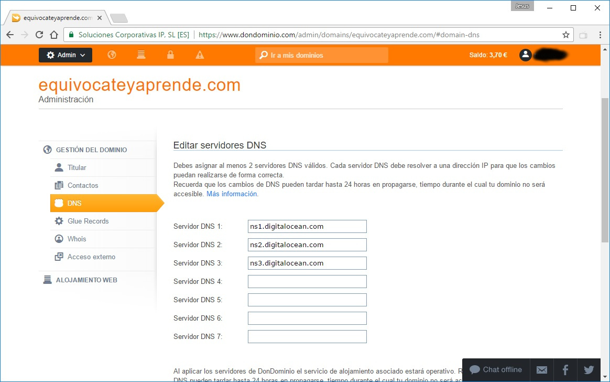

# Paso 5: Vinculando un nombre de dominio a nuestra máquina de Digital Ocean

Se vinculará un nombre de dominio a la IP de la máquina que acabamos de crear en Digital Ocean, de esta forma podemos acceder al libro tecleando el nombre del dominio, pero si deseas puedes acceder con tu dirección IP pública.

Para esto, dentro de nuestra cuenta de Digital Ocean vamos a **Droplets, More, add a domain** y escribimos el nombre del dominio que deseamos vincular.

 Una vez añadido copiamos los NS, vamos al sitio web donde tenemos registrado nuestro dominio y lo pegamos en la **zona de DNS**, en mi caso he utilizado **dondominio.com**. Debes tener en cuenta que este proceso puede tardar hasta 24 horas ya que las DNS deben propagarse por los diversos servidores en todo el mundo.

Existen diversos portales en Internet como [https://www.whatsmydns.net/](https://www.whatsmydns.net/)  donde puedes verificar el estado de las DNS.

